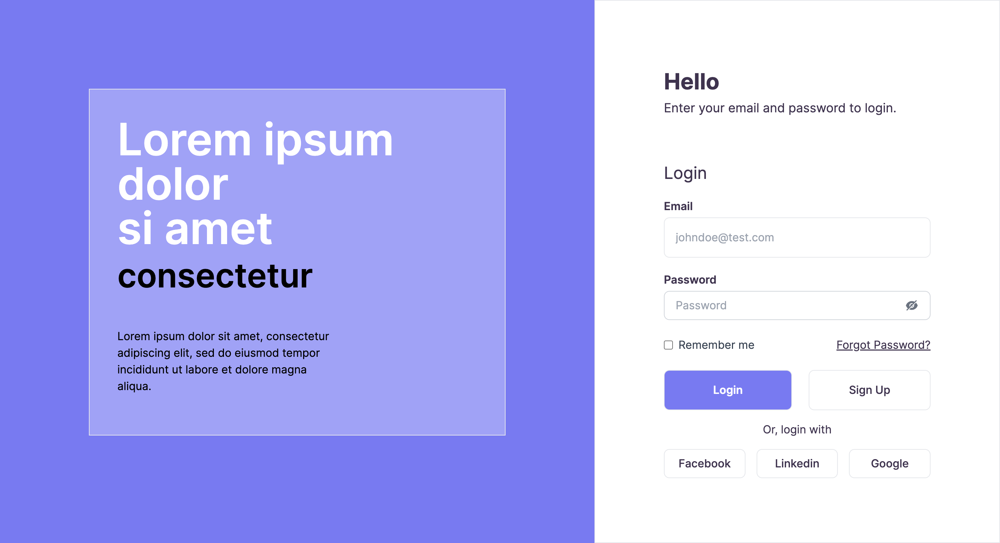
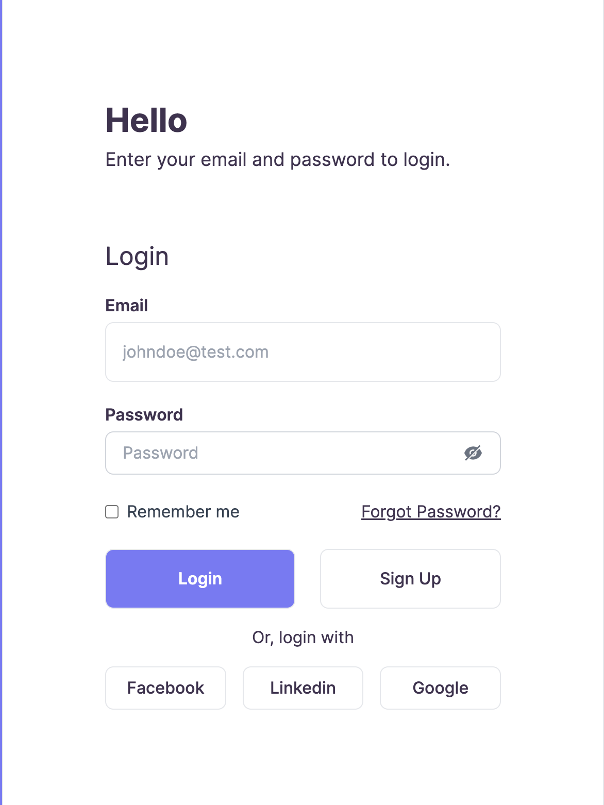

# Project Name - Slicing Login Page with Vite, Tailwind, and TypeScript


Welcome to the README for the **Slicing Login Page** project! This repository contains the code for a login page that has been sliced from a design and built using Vite, Tailwind, and TypeScript. The project also utilizes React Hook Form for form handling, providing a smooth and efficient user experience.

## Tech Stack

- [Vite](https://vitejs.dev/): A fast build tool for modern web development.
- [Tailwind CSS](https://tailwindcss.com/): A utility-first CSS framework for quickly building custom designs.
- [TypeScript](https://www.typescriptlang.org/): A typed superset of JavaScript that compiles to plain JavaScript.
- [React Hook Form](https://react-hook-form.com/): A library for flexible and efficient form validation in React applications.

## Project Preview

## Desktop View


## Mobile View


## Clone and Run

To get started with the project, follow these steps:

1. Clone the repository:

```bash
git clone https://github.com/alfanfauzy/alfan-login-page
```

2. Change into the project directory:

```bash
cd alfan-login-page
```

3. Install the dependencies:

```bash
yarn install
```

4. Run the development server:

```bash
yarn dev
```

This will start the development server, and you can access the application by navigating to `http://localhost:5173` in your web browser.

## How to Use

The login page will be displayed on the homepage. You can interact with the form to enter your login credentials and submit the form. The React Hook Form library handles the form validation, providing real-time feedback to the user.

## Contributing

If you'd like to contribute to this project, feel free to submit issues and pull requests. We welcome any improvements or bug fixes.

## License

This project is licensed under the [MIT License](link_to_license_file). Feel free to use, modify, and distribute the code as per the terms of the license.

---

Thank you for your interest in the **Slicing Login Page** project! If you have any questions or need further assistance, please don't hesitate to contact us. Happy coding!